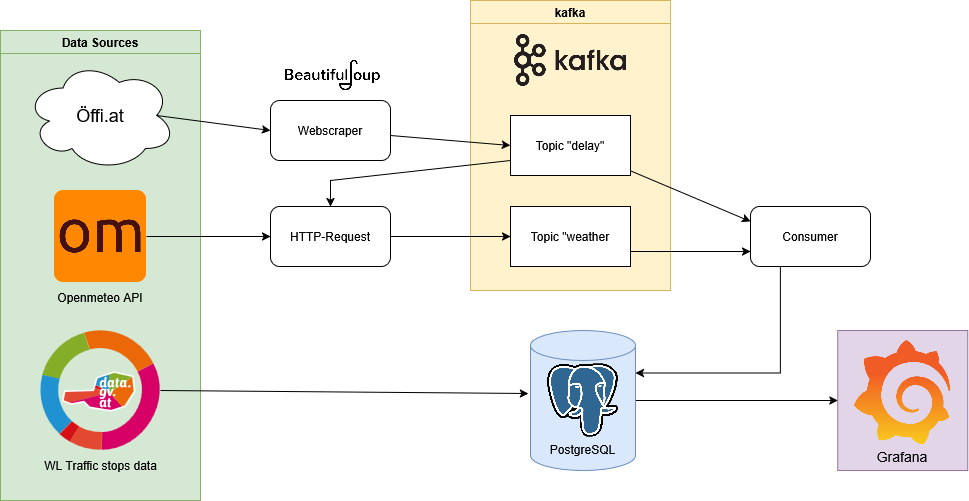
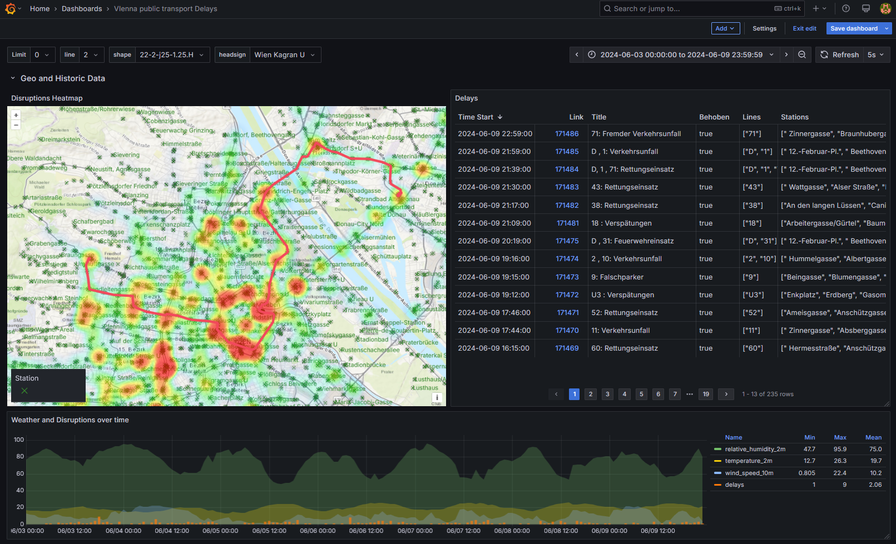
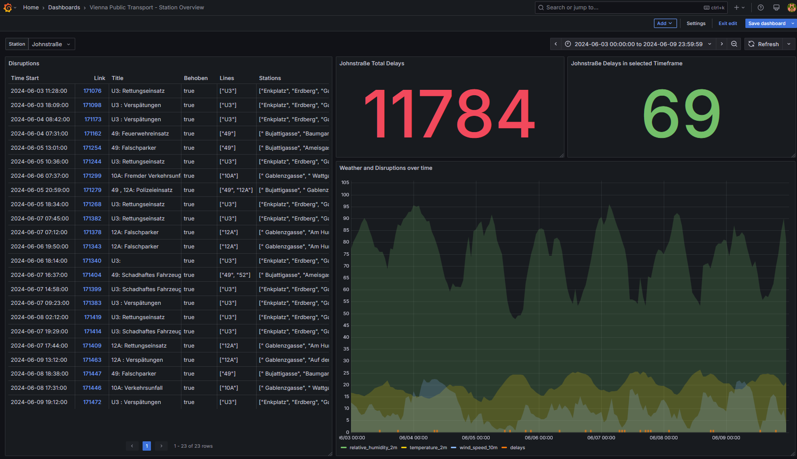

# Smart City Insights: Correlating Wiener Linien Delays with Weather
This project investigates the relationship between public transport disruptions and weather conditions in Vienna. It leverages a production-like, event-driven data pipeline — powered by Docker — to gather, clean, transform, and visualize data.

While the current implementation uses a weather API and web scraping to collect delays, the core vision is to integrate on-site sensor data directly from transport stations for deeper and more accurate insights.

## Infrastructure

### Infrastructure Description

The architecture for data processing and visualization in this project includes the following components:

- `producer_delays`: A custom web scraper implemented in Python using BeautifulSoup to collect data on public transport delays from [öffi.at website](https://öffi.at/?archive=1&text=&types=2%2C3&page=).
- `producer_weather`: A custom API scraper, also in Python, that retrieves weather data from the openmeteo API.
- `Kafka`: Functions as the central messaging bus that transports events, which in this context are the delays and weather data.
- `consumer_00`: A custom Python consumer that processes the data from Kafka.
- `Postgres`: The database utilized for persisting the collected data.
- `Grafana`: The tool used for visualizing the data that has been stored in the Postgres database.

Each of these components plays a critical role in the pipeline from data collection to visualization.




## Datasources
- https://www.data.gv.at/katalog/dataset/wiener-linien-fahrplandaten-gtfs-wien#resources
- https://öffi.at/?archive=1&text=&types=2%2C3&page=
- https://open-meteo.com/

## Data Processing Pipeline

This pipeline details the process for analyzing how weather impacts public transport disruptions in Vienna:

### Data Collection:
- **Producer for Delays (`producer_delays`):**
  
   1. Starts the data collection by scraping the [öffi.at website](https://öffi.at/?archive=1&text=&types=2%2C3&page=) for public transport delay details.
   2. Filters the acquired HTML content for relevant information and sends the data to the Kafka system.

- **Producer for Weather (`producer_weather`):**
  
   3. Monitors the `topic_delays` in Kafka for new public transport interruption events.
   4. Upon detecting new events, it extracts the date and time details.
   5. Uses these details to retrieve corresponding weather conditions from the openmeteo API.
   6. Parses the received weather data and forwards it to Kafka.

### Data Consumption:
- **Consumer (`consumer_00`):**
  
   7. Connects to Kafka topics, ingests the interruption and weather data streams, and processes them for subsequent storage.

### Data Storage:
- **PostgreSQL Database (`Postgres`):**
  
   8. Receives the processed data and serves as the permanent storage solution, ensuring data integrity and accessibility.

### Data Visualization:
- **Grafana:**
  
   9. Utilizes the stored data within Postgres to create visualizations that elucidate the relationship between weather patterns and transport delays.

The entire pipeline is constructed to be both strong and flexible to support 
consistent data processing and enable comprehensive analysis.

## Grafana
### Overview of all stations in Vienna

### Overview of certain station


# Running the setup
### Prerequisities
Ensure you have the following prerequisites installed:
+ docker
+ docker-compose

## Start up

```{bash}
docker-compose up -d
```
The System will autmatically start up and run all collection and processing scripts on creation, no further interaction should be necessary.
Note: To avoid rate limiting, Öffi.at data is scraped at a fairly slow pace, meaning the database and visualization will be almost empty if inspected immediatly after creation. After all containers have started and become ready you should be able to access grafana on http://localhost:13000
> Password and Username are `postgres`
