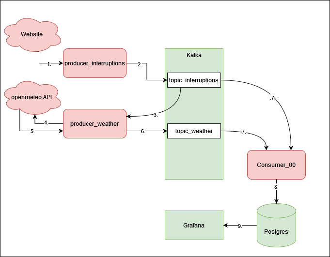

# Data Science Infrastructure Project
By Deleja-Hotko Julian and Topor Karol

## Overview


## Infrastructure



## Prerequisities
Ensure you have the following prerequisites installed:
+ docker
+ docker-compose

## Setup
#### Optional
Depending on where this infrastructure is running you may want to have some node metrics. In our case we are using node-exporter, prometheus and Grafana to get the metrics and visualize them. The needed dashboards are already provisiond. But for the node-exporter to run correctly you have to do the following:

Lets make sure the node_exporter container will be able to mount the root directory so it can serve metrics:

```{bash}
sudo mount --make-shared /
sudo systemctl restart docker
```

With all that setup you can now spin up the containers with docker-compose

# Start up

```{bash}
# cd docker
docker-compose up -d
```
